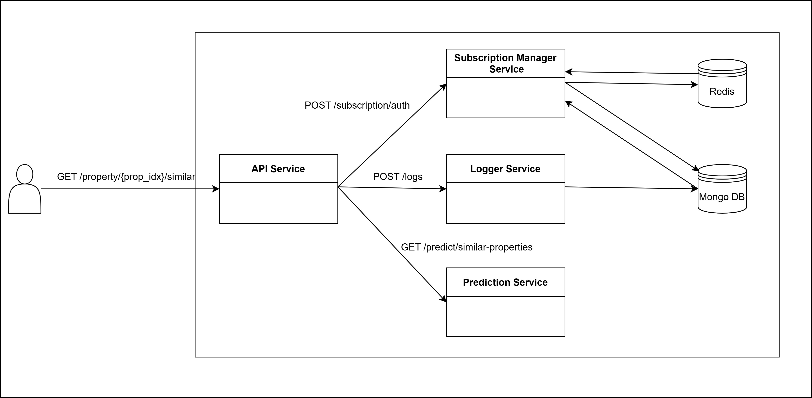

# Predicción de propiedades similares

API de predicción de propiedades similares dado un índice de propiedad, desarrollada bajo una arquitectura de microservicios.

La misma es parte del trabajo final de la materia "Tópicos de Ingeniería de Software 2" correspondiente a la Maestría en Ingeniería de Software (UNLP).


## Índice
- [Arquitectura del Proyecto](#arquitectura-del-proyecto)
- [Diagrama de la Arquitectura](#diagrama-de-la-arquitectura)
- [Endpoint](#endpoint)
- [Carga de API Keys](#carga-de-api-keys)


## Arquitectura del Proyecto

Este proyecto implementa una arquitectura basada en microservicios, utilizando Docker y Docker Compose para la gestión de contenedores. 

El proyecto está compuesto por los siguientes servicios:

- api_service: Servicio principal. Recibe las solicitudes de los clientes de la API.

- logger_service: Servicio para la gestión de logs. Permite el almacenamiento y consulta de logs, llevando un registro de las solicitudes realizadas a api_service.

- subscription_manager_service: servicio encargado del manejo de suscripciones(cuentas) de la API y de la autorización de las solicitudes realizadas a api_service. En este último sentido, controla que las solicitudes a api_service se realicen con una API-Key válida y que las mismas respeten la correspondiente restricción de invocaciones por minuto.

- prediction_service: Servicio de predicción. Dado el índice de una propiedad, retorna el índice y el score de similaridad de las diez propiedades más parecidas. A tal fin, se utiliza un modelo preentrenado (trained_model.pkl).

- mongo: Base de datos NoSQL utilizada para almacenar los logs y las suscripciones.

- redis: Redis es utilizado en este proyecto para gestionar la limitación de solicitudes por minuto de las API Key.

Cada uno de estos servicios se ejecuta en su propio contenedor y se comunican entre sí según las dependencias definidas en docker-compose.yml.

## Diagrama de la Arquitectura



## Carga de API Keys

Para probar este proyecto, se deben cargar las API Keys en la base de datos.

Esto se puede hacer de la siguiente manera:

1. Ejecutar bash dentro del contenedor subscription_manager_service

```bash
sudo docker exec -it subscription_manager_service bash

```

2. Realizar la siguiente solicitud para crear una API-Key Premium

```bash
curl -X POST "http://localhost:5030/subscription/" \
     -H "Content-Type: application/json" \
     -d '{
          "type": "PREMIUM",
          "limit": 50
         }'
```

Como respuesta se recibe la API-Key.

3. Realizar la siguiente solicitud para crear una API-Key Fremium

```bash
curl -X POST "http://localhost:5030/subscription/" \
     -H "Content-Type: application/json" \
     -d '{
          "type": "FREMIUM",
          "limit": 5
         }'
```

Como respuesta se recibe la API-Key.

4. Salir de bash
```bash
exit
```

## Endpoint

### **Obtener propiedades similares**
- **URL:** `http://localhost:5000/property/<property_index>/similar`
- **Método:** `GET`
- **Parámetros:**
    - `property_index` (requerido): Índice de la propiedad para la cual se buscan propiedades similares.
- **Headers:**
    - `x-api-key`: Clave de la API, requerida para autenticar la solicitud.


#### Ejemplo de solicitud

```bash
curl -X GET "http://localhost:5000/property/3/similar" \
     -H "x-api-key: efb638f7b6dcf76b9da73130954032e8"
```

En el caso de que la respuesta sea existosa, el endpoint retornará una salida con el siguiente formato:

```json
{
    "property_index": 3,
    "similar_properties": [
        {
            "property_index": 365585,
            "similarity_score": -14.183927536010742
        },
        {
            "property_index": 364070,
            "similarity_score": -14.138869285583496
        },
        {
            "property_index": 416054,
            "similarity_score": -13.953779220581055
        },
        {
            "property_index": 384593,
            "similarity_score": -13.908589363098145
        },
        {
            "property_index": 409210,
            "similarity_score": -13.874897956848145
        },
        {
            "property_index": 407322,
            "similarity_score": -13.851907730102539
        },
        {
            "property_index": 365209,
            "similarity_score": -13.81315803527832
        },
        {
            "property_index": 376316,
            "similarity_score": -13.76817798614502
        },
        {
            "property_index": 412734,
            "similarity_score": -13.761269569396973
        },
        {
            "property_index": 410994,
            "similarity_score": -13.760458946228027
        }
    ]
}
```